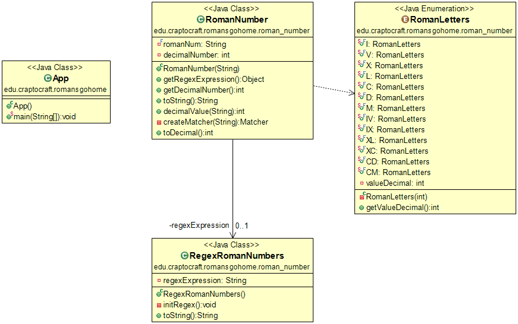
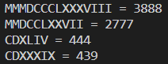

# Romans Go Home

**Table of contents**

-   [**Introduction**](#introduction)
-   [**About the kata**](#about-the-kata)
-   [**UML Diagram**](#uml-diagram)
-   [**Application output**](#application-output)

## Introduction

This is a kata in Java proposed by our teacher with the purpose to practise regular expressions and enum types.

**Link of the kata** [Romans Go Home](https://github.com/dfleta/romans-go-home).  

## About the kata

The program transforms numbers in roman notation into indo-arabic notation.   

The test cases and the main app were writed by my tutor, [dfleta](https://github.com/dfleta/romans-go-home/tree/master/src). The logic to solve the kata was writed by me.   

## UML Diagram

   

## Application output

   
